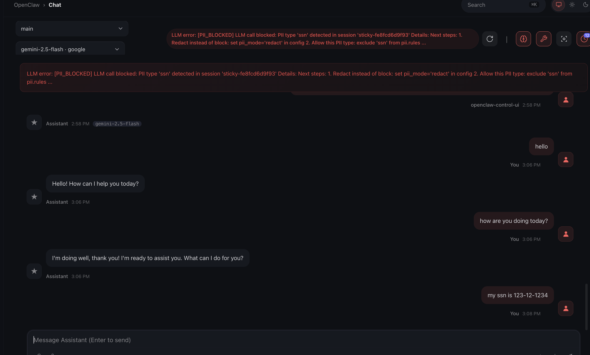

# StateLoom

[](LICENSE)
[](https://python.org)

**The stateful control plane for AI agents.** Track, secure, and optimize every agent run — not just individual LLM calls.

```python
import stateloom
stateloom.init()
# That's it. Every agent run is tracked as a session.
# Open localhost:4782 for the live dashboard.
```


---

## Why StateLoom?

Standard AI gateways operate at the **LLM call level** — they see each API request in isolation. But a single agent run might make 50+ calls across multiple models, tools, and retries. If you can't group those calls into a session, you can't enforce a budget across a task, detect a looping agent, or trace a failure back to its root cause.

StateLoom is **session-aware**. It understands that those 50 calls belong to one agent run, so you can set a $2 budget on the whole task (not per-request), catch an agent spinning in a loop before it burns through your credits, detect PII once and block it for the entire session, and replay a failed run from any step — not just retry the last call.

One line of code. No SDK lock-in. Your existing OpenAI/Anthropic/Gemini/Cohere/Mistral code works unchanged.

---

## Table of Contents

- [Why StateLoom?](#why-stateloom)
- [Install](#install)
- [Quick Start](#quick-start)
- [Agent CLI Integration](#agent-cli-integration)
- [Providers](#providers)
- [For Individual Developers](#for-individual-developers-free--open-source)
- [For Teams & Enterprise](#for-teams--enterprise)
- [Key Examples](#key-examples)
- [Dashboard](#dashboard)
- [Extras](#extras)
- [Configuration](#configuration)
- [Error Handling](#error-handling)
- [Documentation](#documentation)
- [Contributing](#contributing)
- [License](#license)

---

## Install

```bash
pip install stateloom
```

**Requirements:** Python 3.10+ (tested on 3.10, 3.11, 3.12, 3.13). See [extras](#extras) for optional dependencies.

## Quick Start

```python
import stateloom
import openai

stateloom.init()
client = openai.OpenAI()

with stateloom.session("customer-report", budget=2.0, durable=True) as s:
    # Step 1: Research
    research = client.chat.completions.create(
        model="gpt-4o",
        messages=[{"role": "user", "content": "Key trends in AI governance 2025"}],
    )

    # Step 2: Analyze
    analysis = client.chat.completions.create(
        model="gpt-4o",
        messages=[{"role": "user", "content": f"Analyze: {research.choices[0].message.content}"}],
    )

    # Step 3: Synthesize
    report = client.chat.completions.create(
        model="gpt-4o",
        messages=[{"role": "user", "content": f"Write report: {analysis.choices[0].message.content}"}],
    )

    print(f"Total: ${s.total_cost:.2f} | {s.total_tokens} tokens | {s.call_count} calls")

# If this script crashes on Step 3, restarting it skips Steps 1 & 2
# instantly — $0 API cost and 0ms latency.
# Budget enforcement stops the whole run if it exceeds $2 — across all steps, not per-call.
```

## Agent CLI Integration

You already pay for Claude Pro or Gemini Ultra. Use your existing subscription through StateLoom — get cost tracking, PII scanning, budget enforcement, guardrails, and a session timeline for every agent run. No API key needed, no code changes.

**Start the proxy:**

```bash
stateloom serve
```

**Claude CLI:**

```bash
export ANTHROPIC_BASE_URL=http://localhost:4782
claude "explain this codebase"
# All calls appear as one session in the dashboard
```

**Gemini CLI:**

```bash
export CODE_ASSIST_ENDPOINT=http://localhost:4782/code-assist
gemini "refactor the auth module"
```

Both CLIs connect to the same StateLoom instance. Subscription users (Claude Max, Gemini Ultra) work transparently — OAuth tokens pass through to the upstream provider.

[](https://www.youtube.com/watch?v=ZGct2D3Bwb4)


**What you get:**
- Every multi-step agent run grouped into a single session with a waterfall trace timeline
- Per-run cost and token tracking across all tool-use sub-calls
- PII detection and blocking before prompts reach the LLM
- Budget caps per agent run (stop runaway tool loops from burning credits)
- Guardrails (prompt injection detection) on every message
- Exact-match caching to skip duplicate calls
- A fully functional dashboard at `localhost:4782` — toggle PII rules, guardrails, kill switch, budgets, and rate limits on the fly without restarting

**Production mode**

```bash
stateloom serve
```

```bash
export ANTHROPIC_BASE_URL=http://localhost:4782
export ANTHROPIC_API_KEY=ag-...    # Virtual key instead of raw API key
claude "summarize the PR"
```

## Providers

Auto-detects and patches installed LLM clients:

| Provider | Package | Auto-patched | Streaming |
|----------|---------|:------------:|:---------:|
| OpenAI | `openai` | Yes | `stream=True` |
| Anthropic | `anthropic` | Yes | `stream=True` |
| Google Gemini | `google-generativeai` or `google-genai` | Yes | `generate_content_stream()` |
| Cohere | `cohere` | Yes | `chat_stream()` |
| Mistral | `mistralai` | Yes | `chat.stream()` |
| LiteLLM | `litellm` | Yes | `stream=True` |
| Ollama (local) | — | Via `local_model=` | — |

## For Individual Developers (Free & Open Source)

Everything you need to build, test, and debug agents — out of the box.

**Agent Cost Control**
- **Session-scoped cost tracking** — cost per agent run, not just per API call
- **Per-model cost breakdown** — track cost and tokens per model within multi-model sessions
- **Budget enforcement** — hard stop or warn when an agent run exceeds its spend limit

**Agent Safety**
- **PII detection** — detect emails, credit cards, SSNs, API keys (audit/redact/block modes)
- **Guardrails** — prompt injection detection (32 heuristic patterns + NLI classifier + Llama-Guard), jailbreak prevention, system prompt leak protection
- **Zero-trust security engine** — CPython audit hooks (PEP 578) to intercept dangerous operations + in-memory secret vault

**Performance & Caching**
- **Exact-match & semantic caching** — deduplication plus embedding-based similarity matching
- **Loop detection** — catch agents spinning on the same query
- **Session timeouts & cancellation** — max duration, idle timeout, and programmatic cancellation

**Local Models & Smart Routing**
- **Local model support** — run Ollama models locally with hardware-aware recommendations
- **Intelligent auto-routing** — route simple requests to local models based on complexity scoring
- **Model testing** — test candidates against your production model with automated quality scoring and migration readiness reports

**Agent Reliability**
- **Durable resumption** — Temporal-like checkpointing: agent crashes mid-run, restart, resume from cache
- **Semantic retries** — automatic retries for LLM output failures (bad JSON, hallucinated tool calls)
- **Time-travel debugging** — replay a failed agent run from any step with network safety
- **VCR-cassette mock** — record LLM calls once, replay forever for zero-cost testing
- **Named checkpoints** — mark milestones within a session for the dashboard waterfall timeline

**Multi-Model & Experimentation**
- **Multi-agent consensus** — vote, debate, and self-consistency strategies with up to 3 models
- **A/B experiments** — test model variants with built-in assignment, metrics, and backtesting
- **File-based prompt versioning** — drop `.md`/`.yaml`/`.txt` files in a folder; auto-detect changes as new versions

**Developer Experience**
- **Unified chat API** — provider-agnostic `stateloom.chat()` without importing any SDK
- **Session export/import** — portable JSON bundles for sharing, archiving, and migration
- **LangChain / LangGraph integration** — callback handlers for popular agent frameworks
- **Local dashboard & REST API** — live session viewer, security controls, observability charts at `localhost:4782`

## For Teams & Enterprise

Governance and infrastructure for teams running agents in production.

**Gateway & Connectivity**
- **Multi-protocol proxy** — OpenAI, Anthropic-native, and Gemini-native endpoints
- **HTTP reverse proxy** — transparent passthrough for subscription users (Claude Max, Gemini Ultra)
- **Virtual keys** — issue scoped API keys with model restrictions, budgets, and rate limits
- **BYOK (Bring Your Own Key)** — users pass their own provider keys via headers
- **Sticky sessions** — automatic session grouping for proxy clients
- **Billing mode detection** — distinguish API-billed vs subscription users (Claude Max, ChatGPT Plus)

**Access Control & Multi-Tenancy**
- **Multi-tenant hierarchy** — Organizations and Teams with per-level budgets and policies
- **Authentication & RBAC** — JWT auth, OIDC federation, five-tier role hierarchy
- **VK scope enforcement & end-user attribution** — restrict key access per endpoint, track end users
- **Config locking** — admin controls to prevent overriding critical settings

**Operational Safety**
- **Kill switch** — halt all agent traffic instantly, or block specific models/providers with granular rules
- **Blast radius containment** — auto-pause runaway agents and their sessions after repeated failures
- **Circuit breaker** — automatic provider failover on outages
- **Per-team rate limiting** — TPS limits with priority-aware request queueing
- **Compliance enforcement** — declarative GDPR/HIPAA/CCPA profiles with tamper-proof audit trails

**Agent Deployment**
- **Managed agents (Prompts-as-an-API)** — deploy AI agents without code: model + prompt + budget = URL
- **Async jobs** — fire-and-forget LLM calls with webhook notifications
- **Advanced consensus** — unlimited models (10+), judge synthesis, greedy model downgrade, durable replay

**Observability & Model Migration**
- **Observability** — Prometheus metrics, OpenTelemetry tracing, webhook alerting
- **Dark launching** — mirror live traffic to candidate models, validate functional equivalence, get migration confidence scores
- **Distillation flywheel** — auto-generate fine-tuning datasets from production traffic as .jsonl training data

## Key Examples

### PII Detection

```python
from stateloom import PIIRule

stateloom.init(
    pii=True,
    pii_rules=[
        PIIRule(pattern="credit_card", mode="block"),
        PIIRule(pattern="email", mode="redact"),
    ],
)
```




### Guardrails

```python
stateloom.init(
    guardrails_enabled=True,
    guardrails_mode="enforce",             # "audit" or "enforce"
    guardrails_nli_enabled=True,           # NLI classifier (~5-20ms, optional)
    guardrails_local_model_enabled=True,   # Llama-Guard via Ollama
)

# Runtime toggle (no restart needed)
stateloom.configure_guardrails(nli_enabled=True, nli_threshold=0.8)
```


### Kill Switch

```python
stateloom.kill_switch(active=True, message="Maintenance in progress")
stateloom.add_kill_switch_rule(model="gpt-4*", reason="Cost overrun")
```

### Zero-Trust Security

```python
stateloom.init(
    security_audit_hooks_enabled=True,   # CPython audit hooks (PEP 578)
    security_audit_hooks_mode="enforce", # "audit" (log) or "enforce" (block)
    security_audit_hooks_deny_events=["subprocess.Popen", "os.system"],
    security_secret_vault_enabled=True,  # Move API keys to protected vault
    security_secret_vault_scrub_environ=True,  # Scrub from os.environ
)

# Check status
status = stateloom.security_status()

# Store/retrieve secrets programmatically
stateloom.vault_store("CUSTOM_SECRET", "value")
secret = stateloom.vault_retrieve("CUSTOM_SECRET")
```

### Local Models & Auto-Routing

```python
stateloom.init(local_model="llama3.2")
# Simple requests auto-route to local; complex ones go to cloud
```

### Model Testing

```python
stateloom.init(
    shadow=True,
    shadow_model="claude-haiku-4-5-20251001",  # Cloud-to-cloud candidate
    # shadow_model="llama3.2:8b",              # Or local model via Ollama
    shadow_sample_rate=0.5,                     # Test 50% of traffic
)
# Dashboard: localhost:4782 → Model Testing → see similarity scores
```


### Durable Resumption

```python
with stateloom.session(session_id="task-123", durable=True) as s:
    res1 = client.chat.completions.create(...)  # Cache hit on restart
    res2 = client.chat.completions.create(...)  # Resumes here
```

### Multi-Agent Consensus

```python
result = await stateloom.consensus(
    prompt="What are the key risks of deploying LLMs in healthcare?",
    models=["gpt-4o", "claude-sonnet-4-20250514", "gemini-2.0-flash"],
    strategy="debate",   # or "vote", "self_consistency"
    rounds=2,
    budget=1.00,
)
print(result.answer)       # Final synthesized answer
print(result.confidence)   # 0.0-1.0 confidence score
print(result.cost)         # Total cost across all models

# Agent-guided consensus — all debaters use the agent's system prompt
result = await stateloom.consensus(
    agent="medical-advisor",
    prompt="Should we use AI for radiology screening?",
    models=["gpt-4o", "claude-sonnet-4-20250514"],
    strategy="debate",
)
```

### Managed Agents

```python
agent = stateloom.create_agent(
    slug="legal-bot", team_id="team-1",
    model="gpt-4o",
    system_prompt="You are a legal assistant.",
)
# Call via: POST /v1/agents/legal-bot/chat/completions
```

### Proxy

```python
stateloom.init(proxy=True)

# Any SDK, any language:
client = openai.OpenAI(base_url="http://localhost:4782/v1", api_key="ag-...")
```

### Unified Chat API

```python
stateloom.init(default_model="gpt-4o")
response = stateloom.chat(messages=[{"role": "user", "content": "What is the capital of France?"}])
print(response.content)  # "The capital of France is Paris."
```

## Dashboard

Starts automatically at `localhost:4782`. Live session viewer, REST API, and WebSocket event streaming.


- **Overview** — total cost, active sessions, cloud/local calls, PII detections, guardrail detections, cache hits
- **Sessions** — list, detail with waterfall trace timeline, cost/token breakdown, child sessions
- **Experiments** — A/B test management, metrics, leaderboard
- **Consensus** — debate runs, round-by-round breakdown, per-model responses, confidence scores
- **Model Testing** — candidate model evaluation, readiness scores, quality distribution, filtering funnel, migration recommendations
- **Safety** — kill switch rules, blast radius status
- **Security** — audit hooks, secret vault, event log, guardrails (config, detection stats, violation history)
- **Compliance** — GDPR/HIPAA/CCPA profiles, audit trail
- **Observability** — request rate, latency percentiles, cost breakdown charts

See [full API endpoint reference](docs/reference.md#dashboard) for all REST endpoints.

## Extras

```bash
pip install stateloom[langchain]    # LangChain callback handler
pip install stateloom[ner]          # GLiNER NER-based PII detection
pip install stateloom[semantic]     # Semantic caching (FAISS + sentence-transformers)
pip install stateloom[prompts]      # File-based prompt versioning (watchdog)
pip install stateloom[auth]         # OAuth2/OIDC authentication (pyjwt + argon2-cffi)
pip install stateloom[redis]        # Redis cache/queue backend
pip install stateloom[metrics]      # Prometheus metrics
pip install stateloom[tracing]      # OpenTelemetry distributed tracing
pip install stateloom[all]          # Everything
```

## Configuration

```python
stateloom.init(
    budget=10.0,              # Per-session budget (USD)
    pii=True,                 # Enable PII scanning
    guardrails_enabled=True,  # Prompt injection protection
    local_model="llama3.2",   # Enable local models + auto-routing
    shadow=True,              # Model testing
    circuit_breaker=True,     # Provider failover
    compliance="gdpr",        # GDPR/HIPAA/CCPA profiles
)
```

YAML config is also supported:

```python
from stateloom.core.config import StateLoomConfig
config = StateLoomConfig.from_yaml("stateloom.yaml")
```

See [full configuration reference](docs/reference.md#configuration) for all options.

## Error Handling

StateLoom is **fail-open by default** — observability middleware errors (cost tracking, latency, console output) never break your LLM calls. Security-critical middleware (PII blocking, budget hard-stop, guardrails in enforce mode) always fails closed.

For production security environments, set security middleware to enforce mode so violations block requests rather than just logging them:

```python
stateloom.init(
    pii=True,
    pii_rules=[PIIRule(pattern="credit_card", mode="block")],  # Fail closed: block on match
    guardrails_enabled=True,
    guardrails_mode="enforce",          # Fail closed: block prompt injection
    security_audit_hooks_enabled=True,
    security_audit_hooks_mode="enforce", # Fail closed: block dangerous operations
)
```

```python
from stateloom import (
    StateLoomBudgetError,        # Budget exceeded
    StateLoomPIIBlockedError,    # PII block rule triggered
    StateLoomGuardrailError,     # Prompt injection / jailbreak
    StateLoomKillSwitchError,    # Kill switch active
    StateLoomRateLimitError,     # Rate limit exceeded
    StateLoomRetryError,         # All retry attempts exhausted
    StateLoomTimeoutError,       # Session timed out
    StateLoomSecurityError,      # Security policy blocked operation
)
```

See [full error reference](docs/reference.md#error-handling) for all error types.

## Documentation

- **[Full Feature Reference](docs/reference.md)** — detailed docs for every feature with examples, config tables, and YAML snippets
- **[API Reference](docs/api-reference.md)** — complete index of public functions, classes, and enums

## Contributing

We welcome contributions! Here's how to get started:

```bash
# Clone the repo
git clone https://github.com/stateloom/stateloom.git
cd stateloom

# Install in development mode
pip install -e ".[all]"

# Run tests
pytest tests/ -v

# Lint and format
ruff check src/
ruff format src/
```

**Guidelines:**
- All changes need tests. Run `pytest tests/ -v` before submitting.
- Follow existing code patterns — use `ruff` for formatting and linting.
- Security-critical middleware must fail closed. Observability middleware must fail open.
- Events must be typed dataclasses inheriting from `Event`.
- Use `contextvars.ContextVar` for async/thread-safe state, not globals.

See the [CLAUDE.md](CLAUDE.md) file for detailed architecture documentation and conventions.

**Reporting issues:** [GitHub Issues](https://github.com/stateloom/stateloom/issues)

## License

[BSL 1.1](LICENSE)
