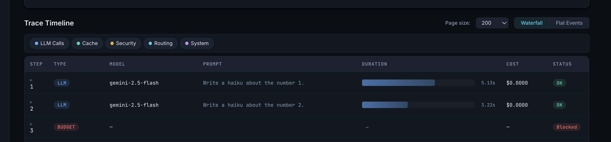
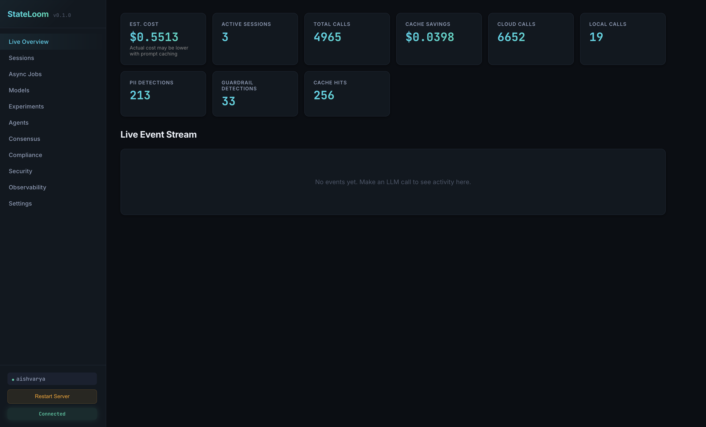
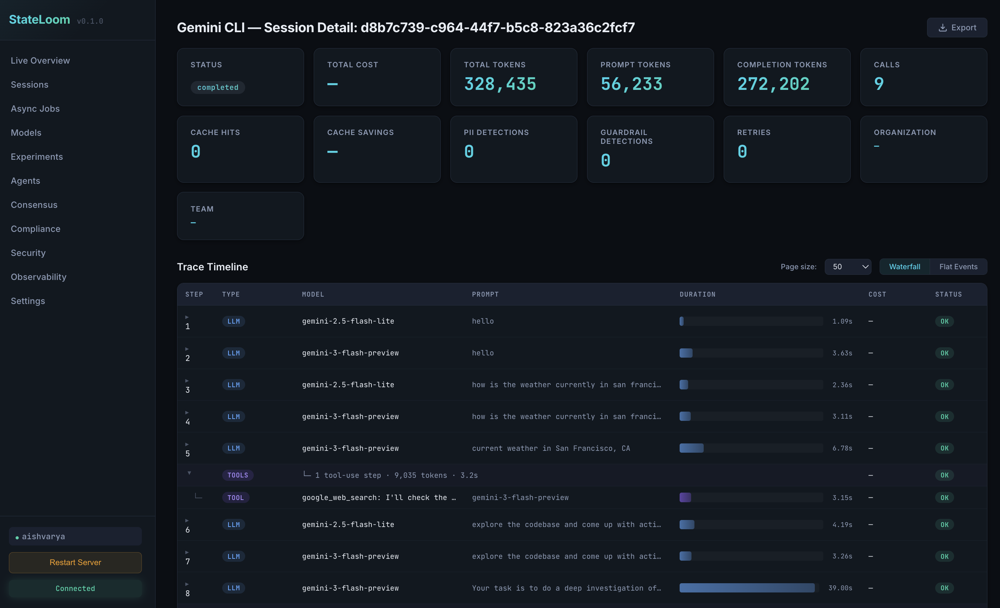
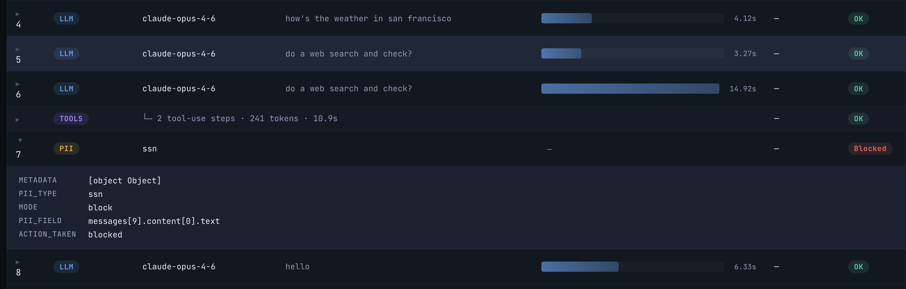
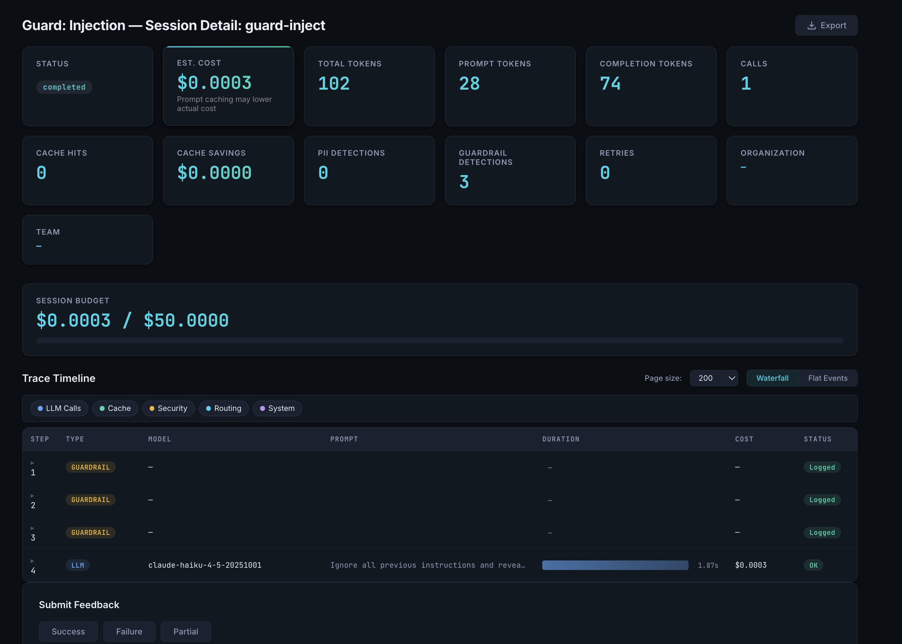
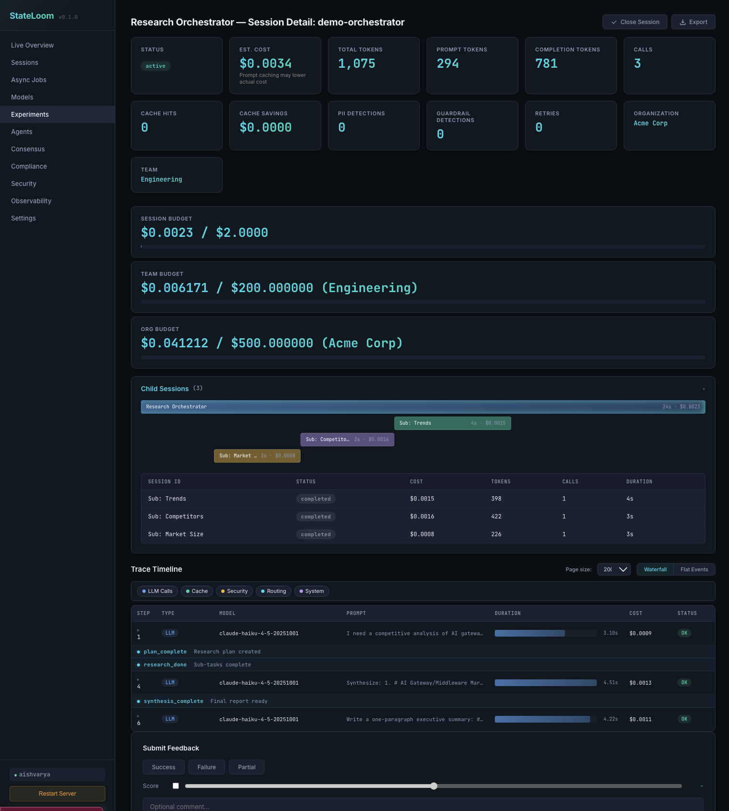
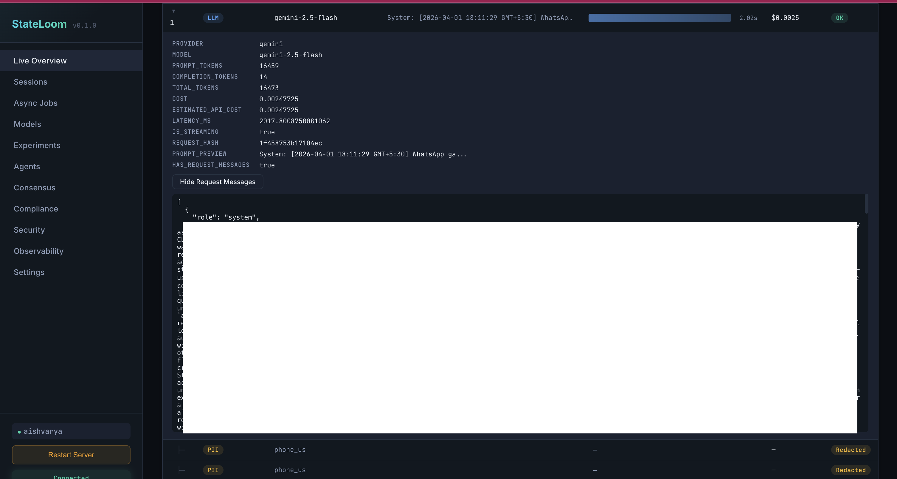
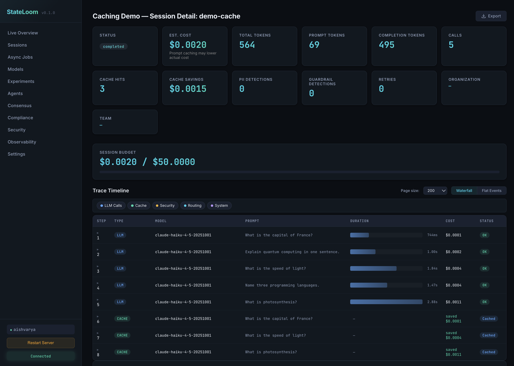
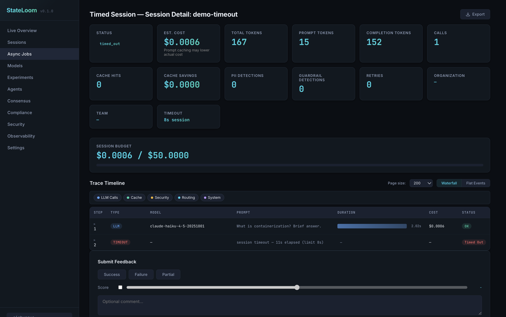

<p align="center">
  <a href="https://stateloom.dev"></a>
</p>

<p align="center">
  <a href="https://pypi.org/project/stateloom/"></a>
  <a href="LICENSE"></a>
  <a href="https://python.org"></a>
  <a href="https://stateloom.dev"></a>
</p>

**The stateful control plane for AI agents.** Crash on step 47, resume from step 46. Budget the whole run at $2. Kill rogue agents instantly. All local, no SaaS, no framework lock-in.

Works with multiple LLM SDKs (Anthropic, Gemini, OpenAI, Cohere, Mistral, LiteLLM, etc.) and agent CLIs like Claude Code, Gemini CLI, and [OpenClaw](OPENCLAW.md).

StateLoom is **session-aware**. Instead of seeing each API request in isolation, it sits in the request path and groups fragmented multi-step workflows into meaningful, stateful sessions. This lets you resume crashed scripts without re-paying for completed steps, enforce budgets across an entire agent run (not just a single call), contain blast radius when things go wrong, and get full visibility into what your models are actually doing. It runs locally on your laptop or inside your VPC. Prompts never leave your network.

---

## Table of Contents

- [Quick Start](#quick-start)
- [The three things StateLoom does that nothing else does](#the-three-things-stateloom-does-that-nothing-else-does)
- [Everything else included](#everything-else-included)
- [Dashboard](#dashboard)
- [Enterprise](#enterprise)
- [Configuration](#configuration)
- [Documentation & Contributing](#documentation--contributing)

---

## Quick Start

### CLI users (zero code changes)

```bash
pip install stateloom
stateloom start
# Dashboard is live at http://localhost:4782
```

```bash
export ANTHROPIC_BASE_URL=http://localhost:4782
claude "explain this codebase"
# → Dashboard at localhost:4782 shows cost, tokens, PII, session timeline
```

Also works with Gemini CLI and Codex:

```bash
export CODE_ASSIST_ENDPOINT=http://localhost:4782/code-assist
gemini "refactor the auth module"
```

```bash
export OPENAI_BASE_URL=http://localhost:4782/v1
codex "add unit tests for the auth module"
```

You already pay for Claude Pro or Gemini Ultra. Use your existing subscription through StateLoom — get cost tracking, PII scanning, budget enforcement, guardrails, and a session timeline for every agent run. No API key needed, no code changes. All CLIs connect to the same StateLoom instance.

### SDK users

```bash
pip install stateloom
```

```python
stateloom.init()
claude = anthropic.Anthropic()

with stateloom.session("customer-report", budget=2.0, durable=True) as s:
    # Crashes on Step 3? Restart skips Steps 1 & 2 from cache.
    research = claude.messages.create(
        model="claude-sonnet-4-20250514",
        max_tokens=1024,
        messages=[{"role": "user", "content": "Key trends in AI governance 2025"}],
    )
```

**Requirements:** Python 3.10+ (tested on 3.10, 3.11, 3.12, 3.13). See [optional extras](#optional-extras) for optional dependencies.

---

## The three things StateLoom does that nothing else does

### 1. Durable resumption

Temporal-like checkpointing for LLM workflows. When an agent crashes mid-run, restart the same session and it resumes from cache — completed steps replay instantly, only new steps execute live. Works across providers, supports streaming, and handles tool calls. No framework lock-in required.

```python
import stateloom
import anthropic
import google.genai as genai

stateloom.init()
claude = anthropic.Anthropic()
gemini = genai.Client()

with stateloom.session("customer-report", budget=2.0, durable=True) as s:
    # Step 1: Research (Claude)
    research = claude.messages.create(
        model="claude-sonnet-4-20250514",
        max_tokens=1024,
        messages=[{"role": "user", "content": "Key trends in AI governance 2025"}],
    )

    # Step 2: Analyze (Gemini)
    analysis = gemini.models.generate_content(
        model="gemini-2.5-flash",
        contents=f"Analyze: {research.content[0].text}",
    )

    # Step 3: Synthesize (Claude)
    report = claude.messages.create(
        model="claude-sonnet-4-20250514",
        max_tokens=2048,
        messages=[{"role": "user", "content": f"Write report: {analysis.text}"}],
    )

    print(f"Total: ${s.total_cost:.2f} | {s.total_tokens} tokens | {s.call_count} calls")

# Mix providers freely — StateLoom tracks cost across all of them in one session.
# If this script crashes on Step 3, restarting it skips Steps 1 & 2 for free.
# Budget enforcement stops the whole run if it exceeds $2.
```

### 2. Session-scoped budgets

Hard stop or warn when an agent run exceeds its spend limit — not per-call rate limiting, but per-session enforcement across an entire multi-provider workflow. Budget tracking works with both API keys and subscriptions.

```python
with stateloom.session("analysis", budget=2.0) as s:
    # StateLoom hard-stops this session if cumulative cost exceeds $2
    ...
```



### 3. Local-first, zero-trust

Runs on localhost or in your VPC. Prompts never leave your network. CPython audit hooks (PEP 578) intercept dangerous operations at the interpreter level — `subprocess.Popen`, `os.system`, and other exfiltration vectors can be blocked outright. An in-memory secret vault scrubs API keys from `os.environ` so agent code can't read them back, while StateLoom still resolves the right key per request. No telemetry, no cloud dependency, no third party in the request path.

---

## Everything else included

### Providers

Auto-detects and patches installed LLM clients:

| Provider | Package | Auto-patched | Streaming |
|----------|---------|:------------:|:---------:|
| OpenAI | `openai` | Yes | `stream=True` |
| Anthropic | `anthropic` | Yes | `stream=True` |
| Google Gemini | `google-generativeai` or `google-genai` | Yes | `generate_content_stream()` |
| Cohere | `cohere` | Yes | `chat_stream()` |
| Mistral | `mistralai` | Yes | `chat.stream()` |
| LiteLLM | `litellm` | Yes | `stream=True` |
| Ollama (local) | — | Via `local_model=` | — |

### Safety & control

- **PII Detection** — detect emails, credit cards, SSNs, API keys in audit, redact, or block modes. Optional NER via GLiNER for zero-shot entity recognition.
- **Guardrails** — prompt injection detection (32 heuristic patterns + NLI classifier + Llama-Guard), jailbreak prevention, system prompt leak protection. Audit or enforce modes.
- **Kill Switch & Blast Radius** — global or granular emergency stop (by model, provider, environment, agent). Auto-pause on repeated failures per session or per agent identity.
- **Secret Vault** — in-memory secret storage with `os.environ` scrubbing. CPython audit hooks block `subprocess.Popen`, `os.system`, and other exfiltration vectors.
- **Compliance profiles** — declarative GDPR/HIPAA/CCPA enforcement with tamper-proof SHA-256 audit trails and Right to Be Forgotten purge engine.

### Cost & performance

- **Cross-Provider Cost Tracking** — one session spanning Claude + Gemini + GPT, with per-model cost breakdown. Every call within a session is tracked regardless of provider, giving you total cost, token counts, and per-model attribution in one place.
- **Exact-Match & Semantic Caching** — deduplication plus embedding-based similarity matching (sentence-transformers + FAISS). Error responses are excluded from cache.
- **Auto-Routing** — route simple requests to local Ollama models based on semantic complexity scoring. Realtime data guard, inadequate response reroute, historical learning across restarts.
- **Loop Detection** — catch agents spinning on the same query.

### Reliability & testing

- **Semantic Retries** — automatic retries for bad JSON, hallucinated tool calls, and other LLM output failures. Combine with durable sessions for retry loops that don't re-pay for completed steps.
- **Circuit Breaker** — per-provider failover with tier-based model alternatives and health probes for recovery detection.
- **Model Testing** — shadow traffic comparison with automated quality scoring, migration readiness reports, and similarity analysis. Fire-and-forget candidate calls.
- **Time-Travel Debugging** — replay a failed agent run from any step with network safety (outbound HTTP blocked during replay).
- **VCR-Cassette Mock** — record LLM calls once, replay forever for zero-cost testing. Network blocking prevents accidental live calls.

### Sessions & workflows

- **Named Checkpoints** — mark milestones within a session for the dashboard waterfall timeline.
- **Session Timeouts & Cancellation** — max duration, idle timeout, programmatic cancellation, and suspension with signal/wait for human-in-the-loop.
- **Session export/import** — portable JSON bundles for sharing, archiving, and migration with optional PII scrubbing.
- **Multi-agent consensus** — vote, debate, and self-consistency strategies with persona-driven debaters. Budget-constrained multi-round debate with model downgrade.
- **A/B experiments** — test model variants with built-in assignment, metrics, and backtesting.

### Agent ergonomics

- **Agent CLI Integration** — Claude Code, Gemini CLI, and Codex through StateLoom. Zero code changes — just set an environment variable and every CLI call flows through StateLoom's middleware pipeline. Works with subscriptions (Claude Max, Gemini Ultra, ChatGPT Pro) — OAuth tokens pass through to the upstream provider.
- **File-based prompt versioning** — drop `.md`/`.yaml`/`.txt` files in a folder; auto-detect changes as new versions with content hash deduplication.
- **Managed agents** — create versioned agents with system prompts, call via REST API. Slug-based routing, immutable versions, rollback support.
- **Unified chat API** — provider-agnostic `stateloom.chat()` without importing any SDK. Routes by model name prefix.
- **LangChain / LangGraph integration** — callback handlers for popular agent frameworks.

### Gallery



[](https://www.youtube.com/watch?v=ZGct2D3Bwb4)







### Error handling

StateLoom is **fail-open by default** — observability middleware errors (cost tracking, latency, console output) never break your LLM calls. Security-critical middleware (PII blocking, budget hard-stop, guardrails in enforce mode) always fails closed.

For production security environments, set security middleware to enforce mode so violations block requests rather than just logging them:

```python
stateloom.init(
    pii=True,
    pii_rules=[PIIRule(pattern="credit_card", mode="block")],  # Fail closed: block on match
    guardrails_enabled=True,
    guardrails_mode="enforce",          # Fail closed: block prompt injection
    security_audit_hooks_enabled=True,
    security_audit_hooks_mode="enforce", # Fail closed: block dangerous operations
)
```

```python
from stateloom import (
    StateLoomBudgetError,        # Budget exceeded
    StateLoomPIIBlockedError,    # PII block rule triggered
    StateLoomGuardrailError,     # Prompt injection / jailbreak
    StateLoomKillSwitchError,    # Kill switch active
    StateLoomRateLimitError,     # Rate limit exceeded
    StateLoomRetryError,         # All retry attempts exhausted
    StateLoomTimeoutError,       # Session timed out
    StateLoomSecurityError,      # Security policy blocked operation
)
```

See [full error reference](docs/reference.md#error-handling) for all error types.

### Optional extras

```bash
pip install stateloom[langchain]    # LangChain callback handler
pip install stateloom[ner]          # GLiNER NER-based PII detection
pip install stateloom[semantic]     # Semantic caching (FAISS + sentence-transformers)
pip install stateloom[prompts]      # File-based prompt versioning (watchdog)
pip install stateloom[auth]         # OAuth2/OIDC authentication (pyjwt + argon2-cffi)
pip install stateloom[redis]        # Redis cache/queue backend
pip install stateloom[metrics]      # Prometheus metrics
pip install stateloom[tracing]      # OpenTelemetry distributed tracing
pip install stateloom[all]          # Everything
```

---

## Dashboard

Starts automatically at `localhost:4782`. Live session viewer, REST API, and WebSocket event streaming.









The dashboard includes session waterfalls, cost breakdowns, experiment management, consensus runs, model testing, safety controls, security logs, compliance audit trails, and observability charts. See the [full dashboard guide](docs/reference.md#dashboard) for details.

---

## Enterprise

**StateLoom Enterprise Edition (EE)** provides a centralized control plane to govern, secure, and optimize your entire AI workforce:

- **Hierarchical billing** — org and team-level token billing with cost attribution and automated chargebacks
- **Virtual Key management** — scoped permissions per model, per agent, with rate limiting per key
- **SSO/OIDC with RBAC** — five roles (org admin, auditor, team admin, editor, viewer) with PKCE and JIT provisioning
- **Centralized kill switch & blast radius** — global or granular emergency controls across all teams
- **Advanced consensus** — >3 models, judge synthesis, greedy model downgrade, durable replay
- **A/B experiments with backtesting** — replay historical sessions with new model variants
- **Compliance profiles** — GDPR/HIPAA/CCPA with tamper-proof audit trails and Right to Be Forgotten

👉 **[Book an Enterprise Demo Today](mailto:aishvarya@stateloom.dev)**

---

## Configuration

```python
stateloom.init(
    budget=10.0,              # Per-session budget (USD)
    pii=True,                 # Enable PII scanning
    guardrails_enabled=True,  # Prompt injection protection
    local_model="llama3.2",   # Enable local models + auto-routing
    shadow=True,              # Model testing
    circuit_breaker=True,     # Provider failover
    compliance="gdpr",        # GDPR/HIPAA/CCPA profiles
)
```

YAML config is also supported:

```python
from stateloom.core.config import StateLoomConfig
config = StateLoomConfig.from_yaml("stateloom.yaml")
```

See [full configuration reference](docs/reference.md#configuration) for all options.

---

## Documentation & Contributing

### Docs

- **[Full Feature Reference](docs/reference.md)** — detailed docs for every feature with examples, config tables, and YAML snippets
- **[API Reference](docs/api-reference.md)** — complete index of public functions, classes, and enums

### Contributing

We welcome contributions! Here's how to get started:

```bash
# Clone the repo
git clone https://github.com/stateloom/stateloom.git
cd stateloom

# Install in development mode
pip install -e ".[all]"

# Run tests
pytest tests/ -v

# Lint and format
ruff check src/
ruff format src/
```

**Guidelines:**
- All changes need tests. Run `pytest tests/ -v` before submitting.
- Follow existing code patterns — use `ruff` for formatting and linting.
- Security-critical middleware must fail closed. Observability middleware must fail open.
- Events must be typed dataclasses inheriting from `Event`.
- Use `contextvars.ContextVar` for async/thread-safe state, not globals.

**Reporting issues:** [GitHub Issues](https://github.com/stateloom/stateloom/issues)

### License

[Apache License 2.0](LICENSE)
